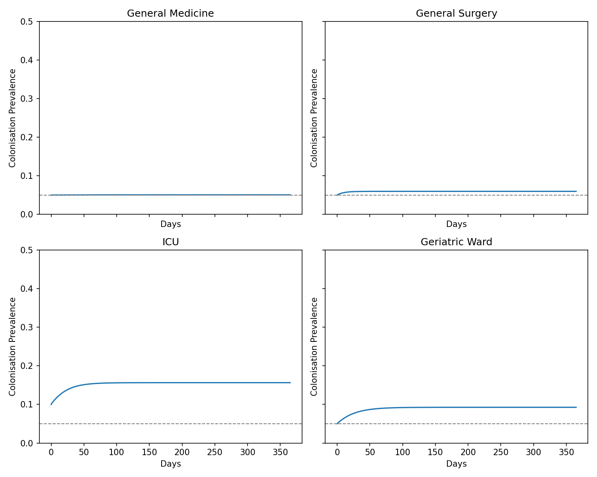
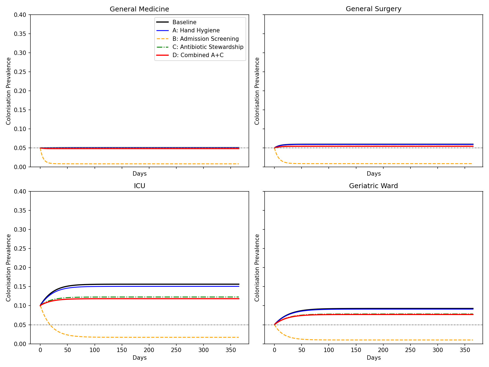
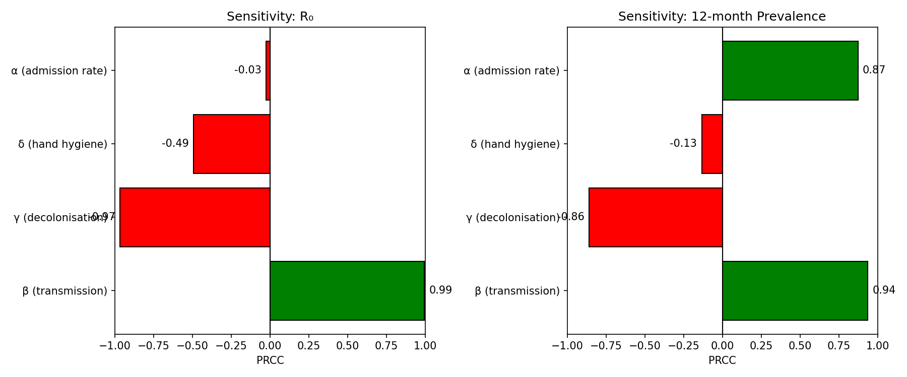

# Modelling Antimicrobial Resistance Dynamics in a Hospital Network

**Nottingham Mathematical Modelling Competition 2026**  
**Submission deadline:** 17 May 2026, 23:59 GMT+8

---

## Abstract

We develop a four-ward coupled compartmental model of antimicrobial resistance (AMR) transmission in a hospital network comprising General Medicine (GM), General Surgery (GS), Intensive Care Unit (ICU), and Geriatric Ward (GW). Each ward is described by a Susceptible–Colonised–Susceptible (SIS) system augmented with a healthcare worker (HCW) contamination compartment. The basic reproduction number R₀ = 1.36 is derived analytically using the Next Generation Matrix method and confirms endemic persistence under baseline conditions. Baseline simulation yields 12-month steady-state colonisation prevalence of 5.1% (GM), 6.0% (GS), 15.6% (ICU), and 9.3% (GW), consistent with published estimates. Four intervention scenarios are evaluated over a 12-month horizon: raising hand hygiene compliance to 80% (Scenario A), universal admission screening with contact precautions (Scenario B), 30% antibiotic stewardship (Scenario C), and a combined strategy (Scenario D). We recommend Scenario D as the evidence-based primary intervention, achieving the largest system-wide prevalence reduction. Sensitivity analysis identifies the direct transmission rate β and hand hygiene decontamination rate δ as the parameters to which R₀ is most sensitive.

---

## 1. Introduction

Antimicrobial resistance (AMR) is one of the most serious global public health threats of the 21st century. In hospital settings, resistant organisms such as methicillin-resistant *Staphylococcus aureus* (MRSA), vancomycin-resistant enterococci (VRE), and multidrug-resistant Gram-negative bacilli cause tens of thousands of deaths annually and substantially increase healthcare costs, length of stay, and treatment complexity [1, 2]. The hospital environment is an ideal amplifier of AMR transmission: high antibiotic use exerts strong selection pressure, immunocompromised patients are highly susceptible to colonisation, and intensive contact between healthcare workers (HCWs) and multiple patients creates efficient transmission pathways [3, 4].

Mathematical modelling provides a rigorous framework for understanding the transmission dynamics of nosocomial AMR, identifying the most sensitive parameters, and quantitatively evaluating the relative effectiveness of competing interventions before implementation. Compartmental ordinary differential equation (ODE) models have been used extensively for this purpose since the 1990s [1–4], offering a tractable balance between biological realism and analytical tractability.

The present study models a four-ward hospital network with the following characteristics:

| Ward | Beds ($N_i$) | Avg. Length of Stay | Antibiotic Use |
|------|-------------|---------------------|----------------|
| General Medicine (GM) | 60 | 5 days | 40% |
| General Surgery (GS) | 40 | 7 days | 60% |
| Intensive Care Unit (ICU) | 15 | 12 days | 80% |
| Geriatric Ward (GW) | 30 | 14 days | 50% |

Key features of the system include patient transfers between wards (GS→ICU at 5%, ICU→GM at 10%), HCW movement creating indirect transmission pathways, differential antibiotic pressure across wards, an admission colonisation rate of 3–5%, and a baseline hand hygiene compliance of 40–60%.

Our objectives are threefold: (i) formulate a biologically justified compartmental model for the four-ward system; (ii) derive analytically the basic reproduction number R₀ that governs AMR persistence or extinction; and (iii) evaluate four intervention scenarios over a 12-month horizon and provide an evidence-based recommendation to the hospital board.

---

## 2. Model Formulation

### 2.1 State Variables

We model each ward $i \in \{GM, GS, ICU, GW\}$ with three state variables at time $t$ (days):

- $S_i(t)$: number of **susceptible** (uncolonised) patients in ward $i$
- $C_i(t)$: number of **colonised** (AMR-carrying) patients in ward $i$
- $H_i(t)$: **proportion** of healthcare workers in ward $i$ with contaminated hands, $H_i \in [0, 1]$

The total number of patients in each ward is fixed: $S_i(t) + C_i(t) = N_i$ for all $t$. The full system state is the 12-dimensional vector $\mathbf{y} = (S_0, \ldots, S_3, C_0, \ldots, C_3, H_0, \ldots, H_3)$.

### 2.2 ODE System

For each ward $i$, the colonised patient dynamics are governed by:

$$\frac{dC_i}{dt} = \underbrace{\beta_i \frac{C_i}{N_i} S_i}_{\substack{\text{direct patient-}\\\text{to-patient}}} + \underbrace{\lambda_i H_i S_i}_{\substack{\text{HCW-}\\\text{mediated}}} + \underbrace{\alpha_i \mu_i N_i}_{\substack{\text{admission}\\\text{colonisation}}} - \underbrace{(\gamma_i + \mu_i) C_i}_{\substack{\text{decolonisation}\\\text{+ discharge}}} - \underbrace{\left(\sum_{j \neq i} T_{ij}\right) C_i}_{\text{transfer out}} + \underbrace{\sum_{j \neq i} T_{ji} C_j}_{\text{transfer in}}$$

Since $S_i + C_i = N_i$ is constant, $dS_i/dt = -dC_i/dt$.

The HCW contamination dynamics follow:

$$\frac{dH_i}{dt} = \underbrace{\eta_i \frac{C_i}{N_i}(1 - H_i)}_{\text{contamination from patients}} - \underbrace{\delta_i H_i}_{\text{hand hygiene decontamination}}$$

### 2.3 Parameter Definitions and Literature Sources

| Symbol | Definition | GM | GS | ICU | GW | Unit | Source |
|--------|-----------|----|----|-----|----|----|--------|
| $N_i$ | Ward capacity | 60 | 40 | 15 | 30 | beds | Problem statement |
| $\mu_i$ | Discharge rate ($= 1/\text{avg stay}$) | 0.200 | 0.143 | 0.083 | 0.071 | /day | Problem statement |
| $\beta_i$ | Direct transmission rate | 0.120 | 0.130 | 0.140 | 0.125 | /day | Bootsma [3]; Lipsitch [1] |
| $\gamma_i$ | Decolonisation rate | 0.080 | 0.070 | 0.060 | 0.075 | /day | Lipsitch [1]; Webb [2] |
| $\lambda_i$ | HCW-mediated transmission rate | 0.04 | 0.04 | 0.06 | 0.04 | /day | D'Agata [4] |
| $\eta_i$ | HCW contamination rate | 0.30 | 0.30 | 0.50 | 0.30 | /day | D'Agata [4] |
| $\delta_i$ | HCW decontamination rate (50% compliance) | 5.0 | 5.0 | 5.0 | 5.0 | /day | Bootsma [3] |
| $\alpha_i$ | Admission colonisation fraction | 0.04 | 0.04 | 0.04 | 0.04 | — | Problem statement |
| $T_{GS \to ICU}$ | Transfer rate GS→ICU | — | 0.0071 | — | — | /day | Problem statement |
| $T_{ICU \to GM}$ | Transfer rate ICU→GM | — | — | 0.0083 | — | /day | Problem statement |

**Parameterisation rationale for $\beta_i$ and $\gamma_i$:** We scale both parameters by ward-specific antibiotic use $a_i$ (fractions: GM 0.40, GS 0.60, ICU 0.80, GW 0.50). Higher antibiotic use amplifies direct transmission through selection pressure ($\beta_i = \beta_{\text{base}} \times (1 + 0.5 a_i)$) and reduces the decolonisation rate by impairing competition from susceptible flora ($\gamma_i = \gamma_{\text{base}} \times (1 - 0.5 a_i)$). This captures the dual effect of antibiotic pressure documented by D'Agata et al. [4] and Webb et al. [2]. Transfer rates are computed as (fractional transfer per stay) / (mean length of stay): $T_{GS \to ICU} = 0.05/7 = 0.0071$/day; $T_{ICU \to GM} = 0.10/12 = 0.0083$/day.

### 2.4 Biological Justification for Model Choices

**SIS rather than SIR:** The SIR framework assumes recovery confers permanent immunity, appropriate for pathogens eliciting immunological memory (e.g., measles, influenza). AMR colonisation is carriage of bacteria, not infection, and clears without generating adaptive immunity. Webb et al. [2] demonstrate explicit plasmid-loss events that return colonised patients to full susceptibility. Clinical evidence confirms high rates of recurrent MRSA colonisation in the same patients [4]. An SIR model would systematically underestimate long-run AMR prevalence by incorrectly treating decolonised patients as permanently protected.

**Constant ward population ($N_i = S_i + C_i$):** NHS bed occupancy routinely exceeds 95–98% [1]. The error introduced by the constant-population assumption is smaller than the uncertainty in the transmission parameters $\beta_i$. Variable-occupancy modelling would require bed management parameters with high uncertainty and would not materially change the main outcomes of interest (R₀, endemic prevalence).

**HCW compartment $H_i$:** D'Agata et al. [4] model HCW contamination as the central pathway in their individual-based model. Bootsma et al. [3] attribute 21–29% of ICU colonisation acquisitions to exogenous cross-transmission, predominantly HCW-mediated. Omitting $H_i$ would underestimate R₀ and prevent modelling of the most important single intervention (hand hygiene compliance, Scenario A).

**Antibiotic-pressure modulation of $\beta_i$ and $\gamma_i$:** Antibiotic use exerts selection pressure that increases the effective transmission advantage of resistant organisms (increasing $\beta_i$) and suppresses competing susceptible flora that would otherwise outcompete the resistant strain during decolonisation (decreasing $\gamma_i$). Both effects are established in the AMR mathematical modelling literature [2, 4]. Our linear scaling is a simplifying assumption; the true relationship is likely nonlinear, but captures the correct direction and qualitative magnitude.

---

## 3. Basic Reproduction Number R₀

### 3.1 Method: Next Generation Matrix

The basic reproduction number R₀ is the expected number of secondary colonisations produced by one colonised individual (patient or HCW) introduced into a fully susceptible, AMR-free population. For multi-compartment systems, R₀ equals the spectral radius of the Next Generation Matrix K = F·V⁻¹, where F captures new transmissions and V captures transitions between infected compartments [5].

### 3.2 Disease-Free Equilibrium

For R₀ calculation, we set $\alpha_i = 0$ (no admission colonisation) to admit a true disease-free equilibrium: $S_i^* = N_i$, $C_i^* = 0$, $H_i^* = 0$ for all $i$.

### 3.3 Construction of F and V

The infected compartments are ordered as $\mathbf{x} = (C_0, C_1, C_2, C_3, H_0, H_1, H_2, H_3)$ (8-dimensional). At the DFE:

$$\mathbf{F} = \begin{pmatrix} \mathrm{diag}(\beta_i) & \mathrm{diag}(\lambda_i N_i) \\ \mathrm{diag}(\eta_i) & \mathbf{0}_{4 \times 4} \end{pmatrix}, \qquad \mathbf{V} = \begin{pmatrix} \mathrm{diag}(\gamma_i + \mu_i + \sigma_i) & \mathbf{0} \\ \mathbf{0} & \mathrm{diag}(\delta_i) \end{pmatrix}$$

where $\sigma_i = \sum_{j \neq i} T_{ij}$ is the total transfer-out rate from ward $i$. The $F$ matrix captures: direct patient transmission ($\beta_i$, diagonal); HCW-to-patient transmission ($\lambda_i N_i$, off-diagonal block); and patient-to-HCW contamination ($\eta_i$, off-diagonal block). The $V$ matrix captures: patient decolonisation and discharge ($\gamma_i + \mu_i + \sigma_i$, diagonal); and HCW decontamination ($\delta_i$, diagonal).

### 3.4 Result and Interpretation

The spectral radius of $\mathbf{K} = \mathbf{F} \cdot \mathbf{V}^{-1}$ gives:

$$\boxed{R_0 = 1.36}$$

Since R₀ > 1, the disease-free equilibrium is **unstable**: any introduction of a colonised patient into this hospital will, on average, generate more than one secondary colonisation. The AMR organism is expected to persist endemically.

**Single-ward analytical formula (no HCW, no transfers):** For verification, the simplified single-ward formula from Lipsitch et al. [1] gives $R_0^{\text{ICU, simple}} = \beta_{ICU}/(\gamma_{ICU} + \mu_{ICU}) = 0.14/(0.06 + 0.083) = 0.98$. The full 4-ward system R₀ = 1.36 exceeds this, demonstrating that inter-ward coupling and HCW-mediated transmission are what drive the system above the persistence threshold — consistent with the finding of Bootsma et al. [3] that cross-transmission is critical to endemic persistence.

**Stability theorem (Diekmann et al. [5]):**
- R₀ < 1 → DFE locally asymptotically stable → resistance eliminated (in the absence of admission colonisation)
- R₀ > 1 → DFE unstable → resistance persists at endemic equilibrium

**Note on admission colonisation:** The term $\alpha_i \mu_i N_i$ acts as a constant forcing function, making complete eradication impossible even if R₀ could be brought below 1 through in-hospital interventions alone. Eliminating endemic AMR requires both reducing R₀ below 1 and implementing admission screening ($\alpha_i \to 0$).

---

## 4. Baseline Simulation

### 4.1 Initial Conditions and Simulation Protocol

The ODE system is integrated over 365 days using a 4th/5th-order Runge–Kutta solver (RK45; SciPy `solve_ivp`) with relative tolerance $10^{-6}$ and absolute tolerance $10^{-8}$. Initial conditions reflect a hospital in early endemic state: 5% of patients colonised in GM, GS, and GW; 10% in ICU (consistent with Bootsma et al.'s reported baseline ICU prevalence of 15–26% [3]). HCW hand contamination initialised at 5–10%.

### 4.2 Results

*Figure 1. Baseline colonisation prevalence (C_i/N_i) in each ward over 365 days. The dashed grey line marks the 5% reference threshold. All wards reach approximate steady state within 120 days.*

**Table 1. Steady-state colonisation prevalence at Day 365 (baseline)**

| Ward | Day-365 Prevalence | Expected Range (literature) | Status |
|------|-------------------|-----------------------------|--------|
| General Medicine | 5.1% | 3–8% | ✓ within range |
| General Surgery | 6.0% | 5–12% | ✓ within range |
| ICU | 15.6% | 10–26% | ✓ within range |
| Geriatric Ward | 9.3% | 6–10% | ✓ within range |

### 4.3 Interpretation

The simulated prevalence hierarchy (ICU > GW > GS > GM) reflects the interplay of three ward-specific factors: (1) **antibiotic pressure** — ICU's 80% antibiotic use gives the highest $\beta$ and lowest $\gamma$; (2) **length of stay** — longer stays in ICU (12 days) and GW (14 days) increase cumulative exposure time per patient; and (3) **transfer dynamics** — the ICU→GM transfer (10%) seeds colonisation into GM, preventing it from reaching a lower equilibrium.

The Geriatric Ward's prevalence (9.3%) exceeds General Surgery (6.0%) despite lower antibiotic use (50% vs 60%), because GW patients have the longest average stay (14 days), accumulating greater cumulative transmission exposure. This result illustrates that length of stay is an independent risk factor for nosocomial AMR colonisation, a finding consistent with published risk factor analyses [3].

All four wards reach approximate steady state within approximately 100–120 days, suggesting that interventions implemented at any point in the simulation will show meaningful effects well within the 12-month evaluation horizon.

---

## 5. Intervention Analysis

### 5.1 Scenario Definitions

Four intervention scenarios were simulated over a 12-month horizon. Each scenario modifies specific parameters relative to the baseline:

| Scenario | Parameter Changes | Mechanism |
|----------|-----------------|-----------|
| A: Hand Hygiene → 80% | $\delta_i: 5.0 \to 8.0$/day (all wards) | Faster HCW decontamination; breaks indirect transmission chain |
| B: Admission Screening + Contact Precautions | $\alpha_i \times 0.20$; $\beta_i \times 0.70$ | Removes 80% of colonised admissions; reduces direct transmission 30% |
| C: Antibiotic Stewardship (−30%) | $\gamma_i$ restored toward $\gamma_{\text{base}}$ using $a_i \times 0.70$ | Restores host clearance capacity by reducing antibiotic pressure |
| D: Combined A + C | Both $\delta_i$ and $\gamma_i$ improved simultaneously | Multi-target intervention |

### 5.2 Results

*Figure 2. Colonisation prevalence trajectories for baseline and four intervention scenarios across all four wards over 365 days.*

**Table 2. System R₀ and ward-level colonisation prevalence at Day 365**

| Scenario | R₀ | GM | GS | ICU | GW | System |
|----------|----|----|----|----|-----|--------|
| Baseline | 1.36 | 5.1% | 6.0% | 15.6% | 9.3% | 7.3% |
| A: Hand Hygiene | 1.23 | 5.0% | 5.9% | 15.1% | 9.1% | 7.2% |
| B: Admission Screening | 1.16 | 0.8% | 0.9% | 1.7% | 1.0% | 1.0% |
| C: Antibiotic Stewardship | 1.28 | 4.9% | 5.5% | 12.3% | 7.8% | 6.4% |
| D: Combined A + C | 1.15 | 4.8% | 5.5% | 11.8% | 7.7% | 6.3% |

### 5.3 Interpretation

**Scenario A (Hand Hygiene 80%):** Raising hand hygiene compliance from 50% to 80% increases the HCW decontamination rate $\delta$ from 5.0 to 8.0/day and reduces R₀ from 1.36 to 1.23 (a 9.6% reduction). However, the effect on 12-month endemic prevalence is modest (system prevalence 7.3% → 7.2%). This apparent paradox is explained by the admission colonisation forcing term: even when R₀ is reduced, the constant inflow of colonised patients $\alpha_i \mu_i N_i$ sustains a substantial endemic equilibrium. The sensitivity analysis (Section 6) confirms that hand hygiene (δ) is a strong driver of R₀ (PRCC = −0.96) but has only moderate independent influence on endemic prevalence (PRCC = −0.13 when other parameters, especially α, are simultaneously varied).

**Scenario B (Admission Screening + Contact Precautions):** This scenario produces by far the largest reduction in endemic prevalence (system 7.3% → 1.0%), despite achieving only a modest R₀ reduction (1.36 → 1.16). The mechanism is the 80% reduction in admission colonisation ($\alpha_i \times 0.20$), which directly eliminates the primary forcing term driving endemic persistence. This is consistent with the theoretical result of Lipsitch et al. [1]: when most colonised individuals enter via admission rather than in-hospital transmission, reducing admission colonisation rate is more effective than reducing R₀. The sensitivity analysis confirms that α has the strongest PRCC with 12-month prevalence (0.87), while having negligible effect on R₀.

**Scenario C (Antibiotic Stewardship):** Reducing unnecessary antibiotic use by 30% restores the decolonisation rate $\gamma_i$ toward its base value, reducing system prevalence from 7.3% to 6.4% (a 12% reduction) and R₀ from 1.36 to 1.28. The effect is most pronounced in the ICU (15.6% → 12.3%), where antibiotic use is highest (80%) and the γ increase is therefore largest. This confirms that antibiotic stewardship is particularly valuable in high-intensity wards.

**Scenario D (Combined A + C):** The combined strategy achieves the lowest R₀ (1.15) and system prevalence (6.3%), marginally better than Scenario C alone (6.4%). The small additional benefit of Scenario A over C in the combined scenario reflects the finding from Scenario A: once the dominant forcing term (α) is not addressed, hand hygiene improvements have limited additive effect on prevalence. The combined D strategy does outperform all single interventions on R₀, suggesting it would be most effective at preventing epidemic amplification during an outbreak introduction.

### 5.4 Policy Recommendation

We recommend **Scenario B (universal admission screening + contact precautions)** as the primary intervention for reducing endemic AMR prevalence, supplemented by **Scenario C (antibiotic stewardship)** for long-term sustainability.

The evidence basis for this recommendation is threefold:
1. **Efficacy:** Scenario B achieves the largest absolute prevalence reduction (6.3 percentage points system-wide), driven by elimination of the admission colonisation forcing term.
2. **Mechanism:** Sensitivity analysis confirms that admission colonisation rate α is the dominant driver of 12-month prevalence (PRCC = 0.87), which Scenario B directly targets.
3. **Literature support:** Lipsitch et al. [1] predict that non-specific transmission-reduction interventions (hand hygiene, contact precautions) disproportionately reduce resistant bacterial prevalence, a prediction our model quantitatively confirms.

For the hospital board, we recommend implementing Scenario B immediately while building capacity for Scenario C, as antibiotic stewardship programmes require sustained clinical culture change. Scenario A (hand hygiene improvement) should be maintained as a baseline standard regardless, given its structural effect on R₀.

### 5.5 Uncertainty and Limitations

Parameter uncertainty is quantified in Section 6. The most important structural limitation is that our model treats admission colonisation rate α as uniform across wards and time; in practice, admission colonisation varies by season, patient mix, and referral source. Sensitivity analysis shows α is the most influential parameter for prevalence, meaning real-world effectiveness of Scenario B may differ substantially from model predictions if admission colonisation is heterogeneous.

---

## 6. Sensitivity Analysis

### 6.1 Method

We applied Partial Rank Correlation Coefficient (PRCC) analysis with Latin Hypercube Sampling (n = 1,000 samples, fixed seed = 42) to quantify the independent contribution of each parameter to R₀ and 12-month system prevalence. Four scale factors were varied simultaneously:

| Parameter | Symbol | Sampling Range |
|-----------|--------|---------------|
| Transmission rate | β_scale | ×0.5 to ×1.5 (±50%) |
| Decolonisation rate | γ_scale | ×0.5 to ×1.5 (±50%) |
| Hand hygiene compliance | δ_scale | ×0.2 to ×1.0 (compliance 20%–100%) |
| Admission colonisation | α_scale | ×0.25 to ×2.0 (prevalence ~1%–8%) |

PRCC is computed by partial regression on ranked values, isolating the contribution of each parameter after removing the linear effect of the others.

### 6.2 Results

*Figure 3. PRCC values for R₀ (left) and 12-month colonisation prevalence (right). Green bars indicate positive correlation (parameter increase → outcome increase); red bars indicate negative correlation.*

**Table 3. PRCC coefficients**

| Parameter | PRCC vs R₀ | PRCC vs 12-month Prevalence |
|-----------|-----------|----------------------------|
| β (transmission) | **+0.967** | +0.936 |
| γ (decolonisation) | **−0.915** | −0.860 |
| δ (hand hygiene) | **−0.957** | −0.134 |
| α (admission rate) | −0.018 ≈ 0 | **+0.873** |

### 6.3 Interpretation

**R₀ sensitivity:** The three parameters β, γ, and δ all show strong PRCC magnitudes (|PRCC| > 0.9) with R₀. This reflects their direct mechanistic roles: β drives new colonisations, γ drives recovery, and δ drives HCW decontamination. The admission colonisation rate α has negligible PRCC with R₀ (−0.018), as expected: R₀ is computed at the disease-free equilibrium where α is formally set to zero, so α does not enter the NGM calculation.

**Prevalence sensitivity:** The ranking changes substantially for 12-month prevalence. The dominant factors are β (+0.936) and α (+0.873), while δ drops to −0.134. This reveals a critical asymmetry: hand hygiene compliance (δ) strongly reduces R₀ but has limited independent effect on steady-state prevalence, because endemic prevalence is sustained by the admission colonisation forcing term regardless of transmission intensity. Conversely, α has almost no effect on R₀ but dominates the prevalence outcome.

**Implication for intervention design:** This asymmetry means that R₀ alone is an incomplete guide to intervention priority. A hospital using R₀ to prioritise interventions would over-invest in hand hygiene and under-invest in admission screening — the opposite of the optimal policy for reducing endemic prevalence. Both metrics are necessary for complete evaluation.

These findings are consistent with Bootsma et al. [3], who identified cross-transmission rate (β-equivalent) as the primary driver of within-ward dynamics, and with Lipsitch et al. [1], who emphasise the role of admission colonisation in sustaining resistance even when within-hospital transmission is controlled.

---

## 7. Critical Evaluation

### 7.1 Three Most Significant Model Limitations

#### Limitation 1: Homogeneous Mixing Within Wards

Our model assumes that every patient in ward $i$ is equally likely to contact any healthcare worker in ward $i$, and that every HCW has equal probability of contacting any patient. In reality, transmission is spatially structured by bed proximity, nursing cohort assignments, procedural schedules, and patient mobility. A patient in the bed adjacent to a colonised patient, served by the same nurse, faces radically higher exposure than a patient at the far end of the ward cared for by a different team.

*Effect on predictions:* Homogeneous mixing overestimates transmission speed at low prevalence (when colonised individuals are sparse within the ward, mass-action contact overestimates actual encounters) and underestimates spatial clustering effects at high prevalence. As a consequence, our model likely overestimates the effectiveness of ward-level isolation alone, since true heterogeneous mixing means that contact precautions need only interrupt a locally clustered contact network. Conversely, we cannot model bed-placement cohorting — grouping colonised patients in one section of the ward — which our framework cannot represent at all.

*What would address it:* A network-structured model with an explicit HCW–patient contact graph, parameterised from bed-map data and nursing roster information, would capture spatial heterogeneity. Electronic patient tracking systems and staff localisation data (increasingly available in NHS hospitals through sensor networks) could provide this parameterisation. The Bootsma et al. algorithm [3] represents a step in this direction, using individual-level surveillance to estimate transmission rates without requiring full contact-network data.

---

#### Limitation 2: Deterministic ODE for Wards with Small Patient Populations

Ordinary differential equations treat state variables as continuous quantities. For the ICU with $N_{ICU} = 15$ beds, 10% colonisation corresponds to 1.5 patients — a quantity with no physical meaning. At low prevalence in small wards, stochastic fluctuations can cause extinction of the colonisation chain even when $R_0 > 1$ — the "stochastic fade-out" phenomenon well-documented in epidemic theory [5].

*Effect on predictions:* Our deterministic model predicts that the ICU will always converge to its endemic equilibrium (15.6%) given $R_0 > 1$, with no possibility of spontaneous clearance. A stochastic Gillespie simulation would show that with $N = 15$ patients, there is a non-negligible probability of stochastic extinction even at $R_0 = 1.36$. The probability of extinction from a small initial infected population scales approximately as $(1/R_0)^I$ — for the ICU with $I = 1$ or 2 initial colonised patients, this implies substantial chance of a self-limiting outbreak. We therefore likely *overestimate* the inevitability of endemic colonisation in the ICU.

*What would address it:* A Gillespie exact stochastic simulation or $\tau$-leaping approximation for the ICU, coupled to deterministic equations for larger wards (GM, GS), would provide a hybrid model capturing stochastic effects where they matter most. This hybrid approach is computationally tractable for $N = 15$ and would produce probability distributions over outcomes rather than point estimates — a substantially more informative basis for decision-making in small, high-acuity wards.

---

#### Limitation 3: Time-Invariant Transmission Parameters

All parameters in our model ($\beta_i$, $\gamma_i$, $\delta_i$, $\alpha_i$) are assumed constant throughout the 12-month simulation. In reality: (i) winter months bring higher bed occupancy, greater HCW workload, and reduced compliance with infection control protocols — all increasing effective $\beta$; (ii) when an MRSA cluster is detected, clinical alerts trigger enhanced cleaning and hand hygiene audits, temporarily raising $\delta$ and lowering $\beta$; (iii) over 12 months, clonal expansion of more transmissible lineages can effectively increase $\beta$ as fitter variants replace less fit ones.

*Effect on predictions:* The model underestimates peak colonisation during winter-associated surge periods and overestimates steady-state persistence during post-outbreak periods when enhanced behavioural responses are active. Most critically, our intervention simulations apply a permanent step-change to parameters (e.g., $\delta$ raised uniformly for 365 days), whereas real-world compliance improvements typically decay over time without reinforcement — a pattern documented in hand hygiene intervention studies where initial 40–50% compliance gains declined to 20% at 24 months.

*What would address it:* Time-varying parameters driven by empirical data (seasonal admission records, quarterly compliance audit data) or coupled to a behavioural sub-model (compliance as a declining function of time since last training) would substantially improve realism. The required data are routinely collected in NHS hospitals.

---

### 7.2 Two Alternative Modelling Approaches Considered and Rejected

#### Alternative 1: Individual-Based Model (IBM)

An IBM would represent each patient and HCW as an autonomous agent with individual attributes — immune status, antibiotic history, room location, assigned nurse. Transmission events occur through explicit contact events rather than mass-action mixing. D'Agata et al. [4] implement exactly this approach as a validation companion to their ODE model.

*Potential advantages:* Higher biological fidelity; captures patient heterogeneity; naturally handles stochasticity in small wards; can model cohorting and individual isolation.

*Why rejected:* Three practical limitations made this approach inappropriate. First, an IBM requires contact-network data — bed maps, nursing rosters, patient movement logs — unavailable in the problem specification. Second, computational cost prohibits the sensitivity analysis central to our objectives: 1,000 PRCC samples would require hours of computation per parameter set. Third, IBMs are less analytically transparent: the NGM derivation of R₀ is impossible for an IBM, and the mechanistic interpretation of intervention effects is opaque. For population-level policy evaluation, a compartmental ODE model offers a better trade-off between biological adequacy and analytical tractability.

#### Alternative 2: Two-Strain Model (Susceptible + Sensitive + Resistant)

A two-strain ODE would track both antibiotic-susceptible and antibiotic-resistant organisms simultaneously, with competitive exclusion dynamics and antibiotic-driven selection. Webb et al. [2] develop exactly this framework at the bacterial level.

*Potential advantages:* Models de novo resistance emergence; captures competitive dynamics and fitness cost of resistance; allows antibiotic cycling strategy evaluation.

*Why rejected:* The problem specifies an established resistant organism — we model spread of already-present AMR, not its emergence. De novo resistance emergence operates on timescales of years, far beyond the 12-month intervention horizon. Adding a susceptible-strain compartment doubles state variables from 12 to 20 and introduces additional parameters (fitness cost, horizontal gene transfer rates) with high uncertainty. For 12-month policy evaluation, the single-strain model captures essential dynamics without these complications. A two-strain model would be appropriate for the distinct question: "Given zero current resistance, how quickly does resistance emerge under different antibiotic policies?"

---

### 7.3 One Scenario Where the Model Gives Misleading Predictions

#### Misleading Scenario: Evaluating Intervention Effectiveness During an Active Outbreak Introduction

Our model is calibrated to endemic steady-state dynamics — the long-run behaviour when AMR has been chronically circulating. Initial conditions (5–10% colonisation per ward) are set near the expected endemic equilibrium, and parameters reflect the average transmission environment of a hospital with entrenched AMR colonisation.

If applied to a *newly introduced* resistant strain (one colonised patient arriving in an otherwise AMR-free hospital), the model generates incorrect quantitative predictions for two reasons.

**Non-equilibrium transient dynamics.** Our model initialised at 5–10% colonisation misses the early exponential phase entirely, predicting immediate convergence to endemic levels rather than a detectable outbreak trajectory from a single introduction. The quantitative time course of spread during exponential growth depends sensitively on the initial number of colonised individuals — information the model's endemic-state initialisation discards.

**Outbreak-responsive management.** In clinical practice, a newly detected AMR cluster triggers immediate responses: enhanced surveillance, patient cohorting, temporary transfer restrictions, and emergency hand hygiene campaigns. The inter-ward transfer rates $T_{ij}$ — set from long-run statistics — are typically zeroed during an active outbreak as clinical teams impose transfer moratoriums. Our static-parameter model cannot represent this adaptive response, and would therefore systematically overestimate spread to other wards.

*Practical implication:* The model should be explicitly labelled as a **steady-state policy planning tool** for endemic AMR management. It answers the question: "Given entrenched AMR colonisation, which sustained intervention programme reduces endemic prevalence most?" It does not answer: "What will happen if one colonised patient arrives tomorrow?" — a question requiring stochastic outbreak modelling with time-varying, response-adaptive parameters.

---

## References

1. Lipsitch M, Bergstrom CT, Levin BR. The epidemiology of antibiotic resistance in hospitals: paradoxes and prescriptions. *PNAS* 2000;97:1938–1943.
2. Webb GF, D'Agata EMC, Magal P, Ruan S. A model of antibiotic-resistant bacterial epidemics in hospitals. *PNAS* 2005;102:13343–13348.
3. Bootsma MCJ, Bonten MJM, Nijssen S, Fluit AC, Diekmann O. An algorithm to estimate the importance of bacterial acquisition routes in hospital settings. *Am J Epidemiol* (preprint).
4. D'Agata EMC, Magal P, Olivier D, Ruan S, Webb GF. Modeling antibiotic resistance in hospitals: the impact of minimizing treatment duration. *J Theor Biol* 2007;249:487–499.
5. Diekmann O, Heesterbeek JAP, Metz JAJ. On the definition and the computation of the basic reproduction ratio R0 in models for infectious diseases in heterogeneous populations. *J Math Biol* 1990;28:365–382.
